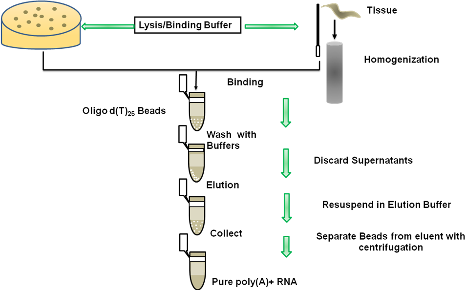
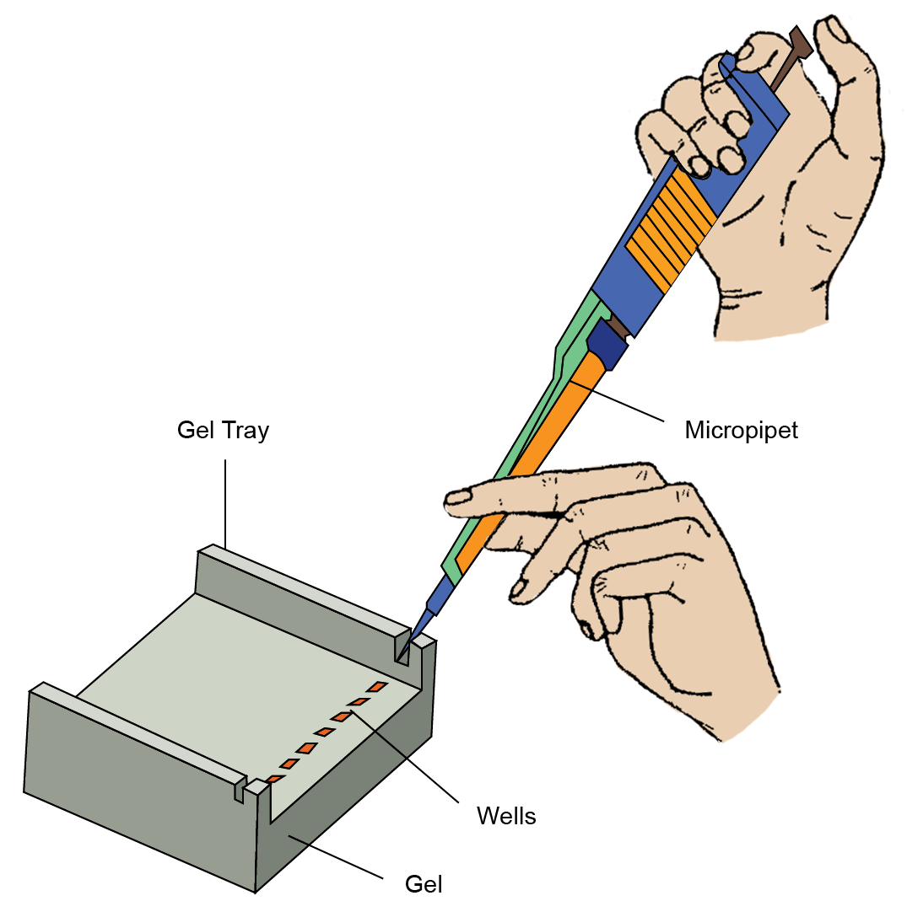
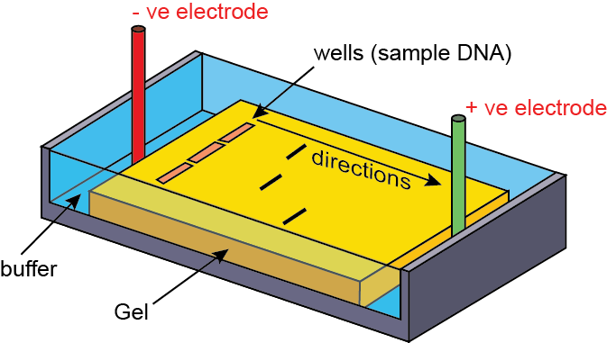
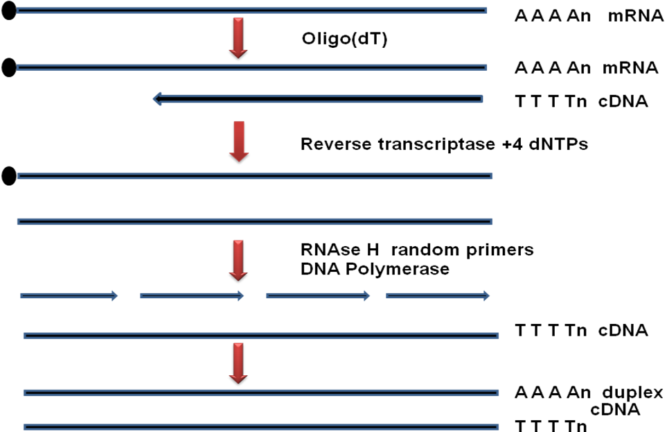
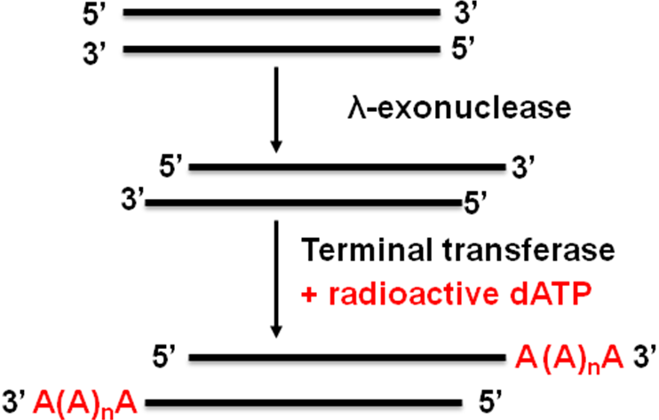
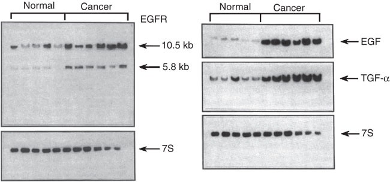

### Procedure

### STEP 1: Isolation of mRNA

The schematic diagram to isolate mRNA from cells is given in Figure 2. Different steps to isolate mRNA is as follows:

1. Release of total RNA either by a lysis buffer containing detergent or by homogenization in the case of hard tissue.
2. Mixing of poly-T containing beads with the total RNA preparation. Due to mutual exclusive affinity, mRNA binds to the poly-T beads.
3. Wash the beads with washing buffer to remove non-specific cross contaminating species.
4. Elute the mRNA from beads and its purity can be checked on polyacrylamide gel.

<b>Figure 2: Isolation of mRNA from cells.</b>

### STEP 2: Preparation and casting of denaturing agarose gel

#### 2.1 Preparation of RNase free water:

1. Dissolve diethylpyrocarbonate (DEPC) in deionized distilled water to a final concentration of 0.1%.
2. Stir this solution for 12 hrs at RT and then autoclave to disintegrate DEPC. Store at room temperature.

#### 2.2 Casting of agarose gel:

1. In a flask, add 1 g agarose to the 75 ml of RNase free water.
2. Heat the solution to melt the agarose and observe the disappearance of agarose flecks.
3. Allow the solution to cool down up to 55 °C. Inside a fuming hood, add 10 ml 10x MOPS buffer and 18 ml 37% formaldehyde.
4. Setup the casting tray with comb and pour the gel in fuming hood.

**[Caution: formaldehyde is very toxic and can be easily absorbed through skin, wear gloves and mask].**

#### 2.3 Preparation of RNA sample:

1. Take the RNA sample and make up to 6.5 µl with appropriate quantity.
2. To each sample, add 2.5 µl 10x MOPS running buffer, 4.5 µl 37% formaldehyde, 11.5 µl formamide.
3. Mix by vortexing and briefly spin to collect the sample at the bottom.
4. Inside the hood, add 5 µl RNA loading buffer, mix by vortexing and briefly spin to collect the sample at the bottom.

#### 2.4 Loading of the RNA sample:

Fill the agarose denatured gel prepared with the 1x MOPS running buffer. Load the RNA sample into the lane (Figure 3).

<b>Figure 3: Loading of RNA sample</b>

#### 2.5 Running the denaturation agarose gel:

Place the lid onto the buffer chamber and perform electrophoresis at 5 V/cm until the dye front reaches the 2/3 length of the gel (Figure 4).

<b>Figure 4: Running the denaturation agarose gel.</b>

### Step 3: Transfer of gel to NC membrane

1. Place the gel in an RNase-free Petri dish, rinse four times with sufficient deionized water, soak the gel for 20 min in 0.05 N NaOH, and keep it in enough 20x SSC for 30 min.
2. Place two pieces of Whatman 1MM paper of the size of gel on the glass plate and wet it with 20x SSC.
3. Place the gel on the filter paper and remove any air bubbles trapped between the gel and the filter paper. Cover sides with plastic wrap.
4. Place a membrane on the gel avoiding the air bubble. Flood the surface of the membrane with 20x SSC.
5. Place four sheets of Whatman 3 MM paper of the same size on the top of the membrane.
6. Place a heap of paper towels on top of the Whatman 3 MM paper and add an approximately 500 g weight and leave overnight.

### Step 4: Preparation of radiolabeled probe DNA

#### Step 4.1: Preparation of probe DNA

**Preparation of complementary DNA (cDNA)-**

Multiple approaches are been developed to prepare complementary DNA (cDNA) from isolated mRNA. In all approaches the 3 steps are performed.

1. First strand synthesis with a reverse transcriptase.
2. Removal of RNA template.
3. Second strand synthesis.

**Gubler-Hoffman method-**

In this approach, after first strand synthesis using oligo dT primer in the presence of reverse transcriptase and dNTPs, DNA:RNA hybrid is treated with RNase-H to produce nicks at multiple sites. Then DNA polymerase is used to perform DNA synthesis using multiple fragments of RNA as primer to synthesize new DNA strand. This method produces blunt end duplex DNA product.

<b>Figure 5: Preparation of Probe DNA</b>

#### Step 4.2: Radiolabeling of probe DNA

**Terminal transferase-**

In this method, a terminal transferase enzyme will label the probe at the ends to the last nucleotide of the probe. Probe is incubated with the labeled nucleotide and terminal transferase enzyme will add the labeled nucleotide at the end. A partial purification with gel filtration column will give labeled primer.

<b>Figure 6: Radiolabeling of Probe DNA</b>

### Step 5: Hybridization

1. Rinse the membrane in 5x SSC. Then place it on a sheet of Whatman 3MM paper, heat for 2 min at full power in a microwave oven, and further cross-link with UV rays (254 nm wavelength) for an appropriate time.
2. For prehybridization of the membrane, wet it in 5x SSC. Next, place it in a prehybridization solution kept in a tube and incubate in an incubator with rotation at 60 °C without a probe.
3. For hybridization, denature a double-stranded probe by heating in a water bath for 10 min at 100 °C and then by quick chilling. Then pipette the desired volume of the probe into the hybridization tube and incubate overnight with rotation at 42 °C for DNA probe.
4. The membrane was washed for 5 min in 1x SSC, 0.1% SDS at room temperature, and washed for 5 min at 68 °C in 0.5x SSC, 0.1% SDS.
5. Air-dry the membrane, expose to sensitive X-ray film at -80 °C with intensifying screens. Prepare an autoradiograph after developing a film.

### Step 6: Autoradiogram

Air-dry the membrane, expose to sensitive X-ray film at -80 °C with intensifying screens. Prepare an autoradiograph after developing a film.

**Result:**

Pancreatic RNA was extracted using the guanidine isothiocyanate method. The membrane was probed with the 32P-labeled EGFR, EGF or TGF-α cDNA and, as a loading control, the 7S cDNA. Figure and legend reprinted with permission from the American Society for Clinical Investigation (conferred through the 'Copyright Clearance Center').
