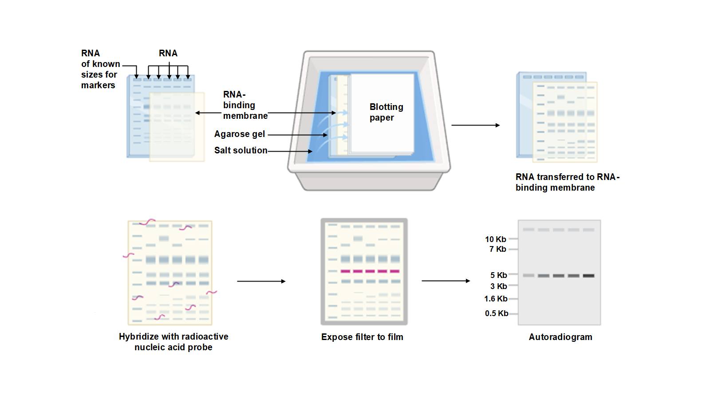

Northern blotting works on the principle of the separating RNA by size using denaturation gel electrophoresis by preventing the secondary structure formation. The separated RNA is transferred to the nitrocellulose membrane. The RNA immobilized on to the membrane and the RNA fragments detected by the adding labelled probe which is complementary to RNA. The hybridized RNA visualized on auto-radiograph. It is a six-step technique for resolving mRNA into denatured agarose gel electrophoresis and detecting a specific gene to determine expression of a particular gene in the organism. The details of each step are given in the procedure, but a schematic outline of these steps is given in Figure 1. It is as follows:

<b>Figure 1: General overview of different steps in Northern Blotting.</b>

1. In the first step, cells are isolated from the cell culture plate, and mRNA was isolated. The quality of mRNA was checked on 0.8% denaturing agarose gel.
2. mRNA fragments were separated on high resolution denaturing agarose gel.
3. mRNA fragments from agarose gel were transferred onto a nitrocellulose membrane. The transfer of mRNA can be checked by a UV transilluminator.
4. Nitrocellulose membrane was blocked with non-specific DNA to avoid binding of the probe to the nitrocellulose surface. A radioactive cDNA probe was prepared, and the membrane was incubated with it in the hybridisation chamber.
5. The membrane was washed with the washing buffer to remove excess probe.
6. Nitrocellulose membrane was incubated with photographic film for 48 hours at -80 °C. Exposure can be optimized based on the radioactive signal from the bound probe.
